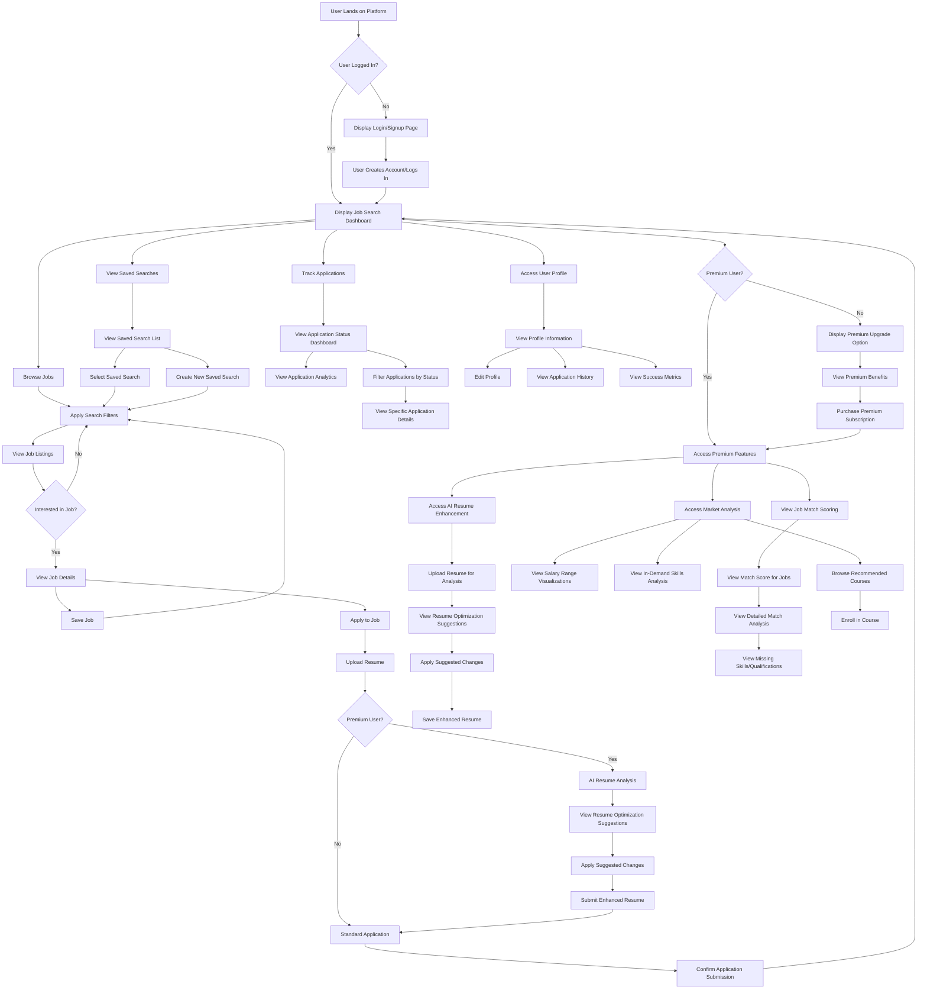

# Backend
```
cd backend && uvicorn app.main:app --reload
```


# Frontend
```
cd frontend && streamlit run streamlit_app.py
```



DataBase

```mermaid
erDiagram
    %% User Database
    Users ||--o{ UserProfiles : has
    Users ||--o{ UserSkills : has
    Users ||--o{ UserExperience : has
    Users ||--o{ UserEducation : has
    Users ||--o{ UserCertifications : has
    Users ||--o{ UserResumes : has
    Users ||--o{ UserPreferences : has
    Users ||--o{ Sessions : has
    Users ||--o{ Applications : submits
    Users ||--o{ SavedSearches : creates
    Users ||--o{ SearchHistory : generates
    Users ||--o{ Subscriptions : purchases
    Users ||--o{ PremiumFeatureUsage : uses
    Users ||--o{ UserCourseEnrollments : enrolls
    Users ||--o{ UserAnalytics : generates

    Skills ||--o{ UserSkills : used_in
    Skills ||--o{ JobSkills : required_in
    SkillCategories ||--o{ Skills : categorizes

    %% Job Database
    Companies ||--o{ Jobs : posts
    Companies ||--o{ CompanyLocations : has
    Industries ||--o{ Companies : categorizes
    Industries ||--o{ Industries : has_sub_industry
    
    Jobs ||--o{ JobSkills : requires
    Jobs ||--o{ Applications : receives
    Jobs ||--o{ SearchIndexJobs : indexed_as
    Jobs ||--o{ JobAnalytics : generates
    
    Locations ||--o{ Jobs : located_in
    Locations ||--o{ CompanyLocations : located_in
    Locations ||--o{ Users : located_in
    Locations ||--o{ SalaryData : references
    
    Companies ||--o{ SearchIndexCompanies : indexed_as
    Companies ||--o{ CompanyAnalytics : generates
    
    %% Application Database
    Applications ||--o{ ApplicationTimeline : tracks
    Applications ||--o{ ApplicationMessages : contains
    Applications ||--o{ InterviewSchedules : schedules
    Applications ||--o{ ApplicationFeedback : receives
    UserResumes ||--o{ Applications : used_in
    
    %% Search Database
    SearchRankingFactors ||--o{ SearchIndexJobs : influences
    SearchRankingFactors ||--o{ SearchIndexCompanies : influences
    
    %% Premium Database
    SubscriptionPlans ||--o{ Subscriptions : defines
    Subscriptions ||--o{ SubscriptionTransactions : generates
    PremiumFeatures ||--o{ PremiumFeatureUsage : tracked_in
    
    %% Content Database
    CourseProviders ||--o{ Courses : offers
    Courses ||--o{ UserCourseEnrollments : has
    Skills ||--o{ Courses : teaches
    
    %% Analytics Database
    Jobs ||--o{ JobAnalytics : measured_in
    Users ||--o{ UserAnalytics : measured_in
    Companies ||--o{ CompanyAnalytics : measured_in
```

# Comprehensive Database Design for Job Platform

## Overview

This document outlines the complete database architecture required for the job platform. The design is organized into seven domain-specific databases that support all functionality while maintaining appropriate separation of concerns.

## 1. User Database

The User Database stores all information related to user accounts, profiles, and authentication.

### Tables

#### Users
- `user_id` (PK): Unique identifier for each user
- `email`: User's email address (unique)
- `password_hash`: Encrypted password
- `first_name`: User's first name
- `last_name`: User's last name
- `phone_number`: Contact phone number
- `location_id` (FK): Reference to Locations table
- `profile_image_url`: URL to profile image
- `account_status`: Account status (active, suspended, deleted)
- `email_verified`: Boolean indicating email verification status
- `registration_date`: Date when user registered
- `last_login_date`: Date of most recent login
- `account_type`: Type of account (basic, premium)

#### UserProfiles
- `profile_id` (PK): Unique identifier for profile
- `user_id` (FK): Reference to Users table
- `headline`: Professional headline/title
- `summary`: Professional summary/bio
- `years_experience`: Total years of professional experience
- `current_job_title`: Current job title
- `current_company`: Current company name
- `desired_job_title`: Desired job title
- `desired_salary_min`: Minimum desired salary
- `desired_salary_max`: Maximum desired salary
- `willing_to_relocate`: Boolean for relocation willingness
- `remote_preference`: Remote work preference
- `privacy_settings`: JSON storing privacy preferences
- `profile_completion`: Percentage of profile completion

#### UserSkills
- `user_skill_id` (PK): Unique identifier 
- `user_id` (FK): Reference to Users table
- `skill_id` (FK): Reference to Skills lookup table
- `proficiency_level`: Self-rated proficiency (1-5)
- `years_experience`: Years of experience with skill
- `is_featured`: Boolean indicating if skill is featured on profile

#### UserExperience
- `experience_id` (PK): Unique identifier
- `user_id` (FK): Reference to Users table
- `company_name`: Name of employer
- `job_title`: Title held at company
- `location_id` (FK): Reference to Locations table
- `start_date`: Employment start date
- `end_date`: Employment end date (null if current)
- `is_current`: Boolean indicating if this is current job
- `description`: Job description and responsibilities
- `achievements`: Notable achievements

#### UserEducation
- `education_id` (PK): Unique identifier
- `user_id` (FK): Reference to Users table
- `institution`: Educational institution name
- `degree`: Degree earned
- `field_of_study`: Major or concentration
- `start_date`: Start date of education
- `end_date`: End date (null if in progress)
- `is_current`: Boolean indicating if currently studying
- `achievements`: Academic achievements

#### UserCertifications
- `certification_id` (PK): Unique identifier
- `user_id` (FK): Reference to Users table
- `name`: Certification name
- `issuing_organization`: Organization that issued certification
- `issue_date`: Date certification was issued
- `expiration_date`: Date certification expires (if applicable)
- `credential_id`: Certification ID/credential number
- `credential_url`: URL to verify certification

#### UserResumes
- `resume_id` (PK): Unique identifier
- `user_id` (FK): Reference to Users table
- `name`: Resume name/label
- `file_url`: Storage URL for resume file
- `created_at`: Creation date
- `updated_at`: Last update date
- `is_default`: Boolean indicating if this is the default resume
- `file_type`: Type of file (PDF, DOCX, etc.)
- `parsed_data`: JSON containing parsed resume data
- `ai_analysis_data`: JSON containing AI analysis results

#### UserPreferences
- `preference_id` (PK): Unique identifier
- `user_id` (FK): Reference to Users table
- `email_notifications`: JSON with email notification preferences
- `push_notifications`: JSON with push notification preferences
- `job_alert_frequency`: Frequency of job alerts
- `search_radius`: Default search radius for location-based searches
- `default_search_filters`: JSON with default search parameters
- `display_settings`: JSON with UI preferences

#### Sessions
- `session_id` (PK): Unique session identifier
- `user_id` (FK): Reference to Users table
- `token`: Authentication token
- `ip_address`: IP address of session
- `device_info`: Device information
- `login_timestamp`: Session start time
- `expiry_timestamp`: Session expiration time
- `last_activity`: Timestamp of last activity
- `is_active`: Boolean indicating if session is active

## 2. Job Database

The Job Database stores all information related to job listings, companies, and related metadata.

### Tables

#### Jobs
- `job_id` (PK): Unique identifier for job
- `company_id` (FK): Reference to Companies table
- `title`: Job title
- `description`: Full job description
- `responsibilities`: Job responsibilities
- `requirements`: Job requirements
- `benefits`: Job benefits
- `location_id` (FK): Reference to Locations table
- `is_remote`: Boolean indicating if job is remote
- `employment_type`: Type of employment (full-time, part-time, contract, etc.)
- `experience_level`: Required experience level
- `education_level`: Required education level
- `salary_min`: Minimum salary
- `salary_max`: Maximum salary
- `salary_currency`: Currency for salary
- `salary_period`: Period for salary (hourly, monthly, yearly)
- `salary_visible`: Boolean indicating if salary is visible to applicants
- `posting_date`: Date job was posted
- `expiration_date`: Date job expires
- `status`: Status of job (active, filled, expired)
- `views_count`: Number of views
- `applications_count`: Number of applications
- `featured`: Boolean indicating if job is featured
- `is_verified`: Boolean indicating if job is verified

#### Companies
- `company_id` (PK): Unique identifier for company
- `name`: Company name
- `description`: Company description
- `website`: Company website URL
- `industry_id` (FK): Reference to Industries lookup table
- `company_size`: Size range of company
- `founded_year`: Year company was founded
- `headquarters_location_id` (FK): Reference to Locations table
- `logo_url`: URL to company logo
- `cover_image_url`: URL to company cover image
- `social_links`: JSON with social media links
- `verified`: Boolean indicating if company is verified
- `rating`: Average company rating from reviews

#### CompanyLocations
- `company_location_id` (PK): Unique identifier
- `company_id` (FK): Reference to Companies table
- `location_id` (FK): Reference to Locations table
- `is_headquarters`: Boolean indicating if this is HQ
- `address_line1`: Street address line 1
- `address_line2`: Street address line 2
- `is_active`: Boolean indicating if location is active

#### JobSkills
- `job_skill_id` (PK): Unique identifier
- `job_id` (FK): Reference to Jobs table
- `skill_id` (FK): Reference to Skills lookup table
- `is_required`: Boolean indicating if skill is required
- `is_preferred`: Boolean indicating if skill is preferred
- `experience_years`: Years of experience required

#### Locations
- `location_id` (PK): Unique identifier
- `country`: Country name
- `country_code`: 2-letter country code
- `state_province`: State or province
- `city`: City name
- `postal_code`: Postal code
- `latitude`: Geographic latitude
- `longitude`: Geographic longitude
- `timezone`: Local timezone

#### Industries
- `industry_id` (PK): Unique identifier
- `name`: Industry name
- `description`: Industry description
- `parent_industry_id` (FK): Self-reference for industry hierarchy

#### Skills
- `skill_id` (PK): Unique identifier
- `name`: Skill name
- `description`: Skill description
- `category_id` (FK): Reference to SkillCategories table

#### SkillCategories
- `category_id` (PK): Unique identifier
- `name`: Category name
- `description`: Category description

## 3. Application Database

The Application Database tracks all job applications and their lifecycle.

### Tables

#### Applications
- `application_id` (PK): Unique identifier
- `job_id` (FK): Reference to Jobs table
- `user_id` (FK): Reference to Users table
- `resume_id` (FK): Reference to UserResumes table
- `cover_letter_text`: Cover letter content
- `status`: Application status (submitted, reviewed, interview, rejected, offered, accepted)
- `submission_date`: Date application was submitted
- `last_updated`: Date application was last updated
- `is_premium`: Boolean indicating if submitted with premium status
- `match_score`: AI-calculated match score
- `viewed_by_employer`: Boolean indicating if viewed by employer
- `viewed_date`: Date application was viewed by employer
- `source`: Source of application (search, recommendation, etc.)
- `custom_questions`: JSON with responses to custom questions
- `notes`: Applicant notes

#### ApplicationTimeline
- `timeline_id` (PK): Unique identifier
- `application_id` (FK): Reference to Applications table
- `status`: Status at this point
- `timestamp`: When status changed
- `notes`: Any notes associated with status change
- `actor_id`: ID of user who changed status (recruiter or system)

#### ApplicationMessages
- `message_id` (PK): Unique identifier
- `application_id` (FK): Reference to Applications table
- `sender_id`: ID of sender (user or recruiter)
- `sender_type`: Type of sender (applicant, recruiter, system)
- `message`: Message content
- `timestamp`: When message was sent
- `read`: Boolean indicating if message was read
- `read_timestamp`: When message was read

#### InterviewSchedules
- `interview_id` (PK): Unique identifier
- `application_id` (FK): Reference to Applications table
- `interview_type`: Type of interview (phone, video, in-person)
- `scheduled_date`: Scheduled date and time
- `duration_minutes`: Duration in minutes
- `location`: Interview location (or URL for virtual)
- `interviewer_names`: Names of interviewers
- `notes`: Interview notes
- `status`: Status (scheduled, completed, canceled, rescheduled)
- `feedback`: Post-interview feedback

#### ApplicationFeedback
- `feedback_id` (PK): Unique identifier
- `application_id` (FK): Reference to Applications table
- `stage`: Application stage when feedback provided
- `rating`: Numerical rating
- `strengths`: Noted strengths
- `weaknesses`: Areas for improvement
- `decision`: Decision (move forward, reject, hold)
- `provided_by`: ID of person providing feedback
- `timestamp`: When feedback was provided
- `is_shared_with_applicant`: Boolean indicating if shared with applicant

## 4. Search Database

The Search Database optimizes job and content searching capabilities.

### Tables

#### SavedSearches
- `search_id` (PK): Unique identifier
- `user_id` (FK): Reference to Users table
- `name`: Search name
- `search_parameters`: JSON with search parameters
- `created_at`: Creation date
- `last_executed`: When search was last executed
- `notification_enabled`: Boolean indicating if notifications are enabled
- `notification_frequency`: Frequency of notifications
- `result_count`: Number of results from last execution

#### SearchHistory
- `history_id` (PK): Unique identifier
- `user_id` (FK): Reference to Users table
- `search_query`: Search query text
- `search_filters`: JSON with applied filters
- `timestamp`: When search was performed
- `results_count`: Number of results returned
- `interaction_data`: JSON with user interaction data

#### SearchIndexJobs
- `index_id` (PK): Unique identifier
- `job_id` (FK): Reference to Jobs table
- `search_vector`: Optimized text search vector
- `keywords`: Extracted keywords
- `last_indexed`: When job was last indexed
- `relevance_factors`: JSON with factors affecting search relevance

#### SearchIndexCompanies
- `index_id` (PK): Unique identifier
- `company_id` (FK): Reference to Companies table
- `search_vector`: Optimized text search vector
- `keywords`: Extracted keywords
- `last_indexed`: When company was last indexed

#### SearchRankingFactors
- `factor_id` (PK): Unique identifier
- `name`: Factor name
- `description`: Description of ranking factor
- `weight`: Weight in search algorithm
- `is_active`: Boolean indicating if factor is active

## 5. Premium Database

The Premium Database manages subscription information and premium feature access.

### Tables

#### Subscriptions
- `subscription_id` (PK): Unique identifier
- `user_id` (FK): Reference to Users table
- `plan_id` (FK): Reference to SubscriptionPlans table
- `status`: Subscription status (active, canceled, expired)
- `start_date`: Start date of subscription
- `end_date`: End date of subscription
- `renewal_date`: Next renewal date
- `payment_method_id`: Reference to payment method
- `auto_renew`: Boolean indicating if subscription auto-renews
- `subscription_source`: Source of subscription

#### SubscriptionPlans
- `plan_id` (PK): Unique identifier
- `name`: Plan name
- `description`: Plan description
- `price`: Plan price
- `currency`: Currency code
- `billing_period`: Billing period (monthly, annually)
- `features`: JSON with included features
- `is_active`: Boolean indicating if plan is active
- `trial_days`: Number of trial days

#### SubscriptionTransactions
- `transaction_id` (PK): Unique identifier
- `subscription_id` (FK): Reference to Subscriptions table
- `amount`: Transaction amount
- `currency`: Currency code
- `transaction_date`: Date of transaction
- `status`: Transaction status
- `payment_provider`: Payment provider name
- `payment_reference`: Reference from payment provider
- `invoice_url`: URL to invoice

#### PremiumFeatureUsage
- `usage_id` (PK): Unique identifier
- `user_id` (FK): Reference to Users table
- `feature_id` (FK): Reference to PremiumFeatures table
- `usage_count`: Number of times feature was used
- `last_used`: When feature was last used
- `remaining_quota`: Remaining usage quota, if applicable

#### PremiumFeatures
- `feature_id` (PK): Unique identifier
- `name`: Feature name
- `description`: Feature description
- `category`: Feature category
- `quota_period`: Period for quota (daily, monthly)
- `quota_amount`: Amount of quota
- `is_active`: Boolean indicating if feature is active

## 6. Content Database

The Content Database stores educational content, courses, and learning resources.

### Tables

#### Courses
- `course_id` (PK): Unique identifier
- `title`: Course title
- `description`: Course description
- `provider_id` (FK): Reference to CourseProviders table
- `skill_id` (FK): Reference to Skills table
- `level`: Course difficulty level
- `duration_hours`: Duration in hours
- `price`: Course price
- `currency`: Currency code
- `is_free`: Boolean indicating if course is free
- `url`: URL to course
- `image_url`: URL to course image
- `rating`: Average rating
- `reviews_count`: Number of reviews
- `enrollment_count`: Number of enrollments

#### CourseProviders
- `provider_id` (PK): Unique identifier
- `name`: Provider name
- `description`: Provider description
- `website`: Provider website
- `logo_url`: URL to provider logo
- `is_verified`: Boolean indicating if provider is verified

#### UserCourseEnrollments
- `enrollment_id` (PK): Unique identifier
- `user_id` (FK): Reference to Users table
- `course_id` (FK): Reference to Courses table
- `enrollment_date`: Date of enrollment
- `completion_date`: Date of completion
- `completion_percentage`: Percentage completed
- `certificate_url`: URL to completion certificate
- `user_rating`: User's rating of course
- `user_review`: User's review of course

#### MarketInsights
- `insight_id` (PK): Unique identifier
- `title`: Insight title
- `description`: Insight description
- `category`: Insight category
- `content`: Insight content
- `publish_date`: Date published
- `expiration_date`: Date insight expires
- `is_premium`: Boolean indicating if insight is premium content
- `view_count`: Number of views

#### SalaryData
- `data_id` (PK): Unique identifier
- `job_title`: Job title
- `industry_id` (FK): Reference to Industries table
- `location_id` (FK): Reference to Locations table
- `experience_level`: Experience level
- `salary_min`: Minimum salary
- `salary_max`: Maximum salary
- `salary_median`: Median salary
- `salary_currency`: Currency code
- `data_source`: Source of data
- `sample_size`: Sample size for data
- `last_updated`: When data was last updated

## 7. Analytics Database

The Analytics Database aggregates data for reporting and analysis.

### Tables

#### UserAnalytics
- `analytics_id` (PK): Unique identifier
- `user_id` (FK): Reference to Users table
- `login_count`: Number of logins
- `average_session_duration`: Average session duration
- `last_30d_activity_days`: Days active in last 30 days
- `job_views_count`: Number of job views
- `search_count`: Number of searches
- `application_count`: Number of applications
- `application_completion_rate`: Application completion rate
- `interview_rate`: Interview success rate
- `offer_rate`: Offer success rate
- `course_enrollment_count`: Number of course enrollments
- `course_completion_rate`: Course completion rate

#### JobAnalytics
- `analytics_id` (PK): Unique identifier
- `job_id` (FK): Reference to Jobs table
- `view_count`: Number of views
- `application_count`: Number of applications
- `application_to_view_ratio`: Ratio of applications to views
- `qualified_applicants_count`: Number of qualified applicants
- `average_applicant_rating`: Average applicant rating
- `time_to_fill`: Days to fill position
- `view_sources`: JSON with view sources
- `application_sources`: JSON with application sources

#### CompanyAnalytics
- `analytics_id` (PK): Unique identifier
- `company_id` (FK): Reference to Companies table
- `profile_views`: Number of company profile views
- `job_views`: Number of company job views
- `application_count`: Number of applications to company jobs
- `average_response_time`: Average time to respond to applications
- `employer_rating`: Average employer rating
- `engagement_metrics`: JSON with engagement metrics

#### PlatformMetrics
- `metric_id` (PK): Unique identifier
- `date`: Date of metrics
- `active_users`: Number of active users
- `new_registrations`: Number of new registrations
- `premium_conversions`: Number of premium conversions
- `job_postings`: Number of new job postings
- `applications`: Number of applications
- `search_queries`: Number of search queries
- `revenue`: Daily platform revenue
- `user_retention_rate`: User retention rate

#### SearchAnalytics
- `analytics_id` (PK): Unique identifier
- `date`: Date of analytics
- `search_term`: Search term
- `search_count`: Number of searches
- `result_count_avg`: Average number of results
- `click_through_rate`: Click-through rate
- `conversion_rate`: Conversion rate to applications
- `average_position_clicked`: Average position of clicked results

#### RecommendationPerformance
- `performance_id` (PK): Unique identifier
- `user_id` (FK): Reference to Users table
- `recommendation_type`: Type of recommendation
- `impressions`: Number of impressions
- `clicks`: Number of clicks
- `applications`: Number of applications from recommendations
- `algorithm_version`: Version of recommendation algorithm
- `accuracy_score`: Algorithm accuracy score
